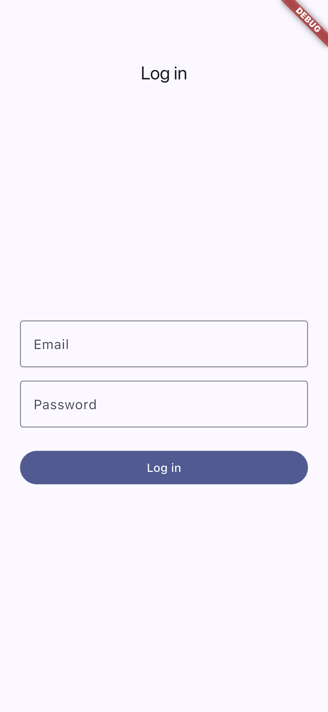
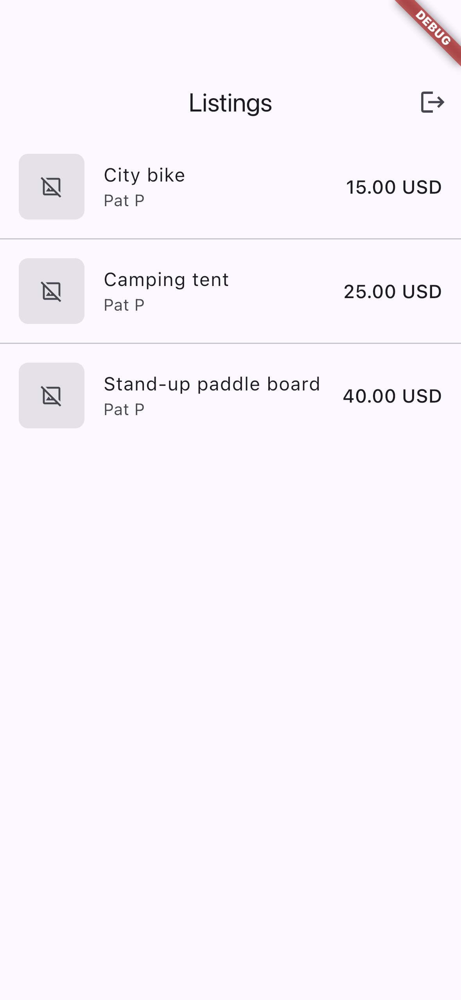
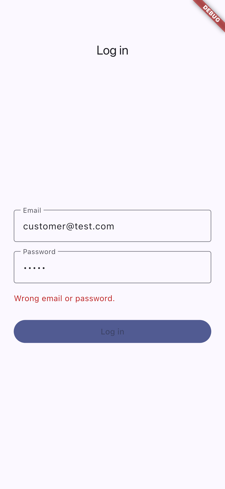

# Sharetribe Flutter assessment

A Sharetribe Flex marketplace with a modified transaction process, plus a Flutter app that logs in to Sharetribe and lists listings. The original task is in [`docs/brief.md`](docs/brief.md).

| Part | Where | What it is |
|--|--|--|
| Transaction process | [`sharetribe/`](sharetribe/) | `simple-request` v1, and v2 with a provider accept step |
| Flutter app | [`flutter_app/`](flutter_app/) | Login, session restore, listings; mock or live |
| Why things are as they are | [`docs/adr/`](docs/adr/) | One short record per decision |

**In a hurry?** `cd flutter_app && flutter run` starts the app offline with mock data; log in as `customer@test.com` / `password123`. For the real thing, follow steps 1 and 2 below.

## What is built

- Sharetribe process v1 and v2 as `process.edn` + email templates, ready to push. Publishing them needs Console access, so it is a human step (step 1).
- Flutter: login (password grant, `scope=user`), tokens in Keychain/Keystore, session restore on launch, automatic token refresh on a 401, listings with author, price and image, pull-to-refresh, empty and error states, logout.
- 66 tests, no device and no network needed.

Not built, on purpose: no in-app request flow (the Request button is stretch, [ADR 0005](docs/adr/0005-request-flow-as-stretch.md)), no payments ([ADR 0008](docs/adr/0008-hand-written-no-payment-baseline.md)), no sign-up screen (the repository supports it; the brief asks only for authentication).

## Prerequisites

- **Flutter 3.47.4** stable, pinned in [`.fvmrc`](.fvmrc). Any 3.47.x works. With [FVM](https://fvm.app): `fvm use`, then prefix commands with `fvm`.
- A simulator, emulator or device. Targets are Android and iOS.
- **For the Sharetribe steps only:** Node.js and `npm install -g flex-cli`, plus a Sharetribe account.

## 1. Sharetribe setup (human step, about 15 minutes)

Full commands: [`sharetribe/README.md`](sharetribe/README.md). In short:

1. Create a marketplace (a free trial is enough) and note its **Marketplace ID**.
2. Create the app's credentials: in Console go to **Build → Applications** ([console.sharetribe.com/advanced/applications](https://console.sharetribe.com/advanced/applications)) → **Add new**, choose **Marketplace API**, and copy the **Client ID**. The Client ID stays visible in Console. The application also shows a **client secret** once, and only once — this app never uses it, so leave it where it is. If your marketplace has separate test and live environments, take the Client ID from the one holding your listings.
3. Log in with the CLI, then publish v1 as version 1 and point `release-1` at it.
4. Push v2 as version 2 and create a **new** alias `release-2`. `release-1` never moves, so transactions already running on v1 keep their old rules.
5. In Console, create a **provider** user with at least one **published** listing, and a **customer** user for the app to log in as.

If the app later shows an empty list, this last step is the usual reason.

## 2. Run the app

### Live (what the brief asks for)

```bash
cd flutter_app
flutter pub get
flutter run \
  --dart-define=SHARETRIBE_MODE=live \
  --dart-define=SHARETRIBE_CLIENT_ID=<your-client-id>
```

Log in with the customer user from step 1. The app calls the Marketplace API directly; there is no backend.

For a shorter command line, put the same values in a gitignored file, `flutter_app/live.env.json`:

```json
{ "SHARETRIBE_MODE": "live", "SHARETRIBE_CLIENT_ID": "<your-client-id>" }
```

then `flutter run --dart-define-from-file=live.env.json`.

### Mock (offline fallback, no credentials)

```bash
flutter run --dart-define=SHARETRIBE_MODE=mock   # mock is the default, so plain `flutter run` also works
```

Mock mode serves the same JSON:API shapes from memory through the same parsing code as live mode, so the screens behave identically.

| Mode | Email | Password |
|--|--|--|
| Mock | `customer@test.com` | `password123` |
| Mock | `provider@test.com` | `password123` |
| Live | the customer user you created in Console | the password you set |

## 3. Verify (no device, no network)

```bash
cd flutter_app
make verify                            # flutter analyze, then flutter test
make verify FLUTTER="fvm flutter"      # with FVM
```

This is the project's definition of done. It runs 66 tests, including `test/app_mock_test.dart`, which starts the whole app in mock mode, logs in and checks that listings render.

The tests that matter most for a reviewer:

| File | What it pins down |
|--|--|
| `test/token_refresh_test.dart` | 401 → one refresh → retry; three parallel 401s still refresh **once**; the rotated refresh token is persisted; a dead refresh token clears the session |
| `test/json_api_test.dart`, `test/listing_test.dart` | `data` + `included` denormalizing; missing image variant, price or author map to null, never an error |
| `test/live_repositories_test.dart` | the exact requests sent to Sharetribe, and how failures map to errors |
| `test/app_mock_test.dart` | cold start, login, wrong password, session restore, logout, pull-to-refresh |

### End-to-end on a simulator (optional)

`make verify` runs without a device, so it injects an in-memory token store. One suite goes further and runs the real app on a simulator with real Keychain/Keystore storage ([ADR 0016](docs/adr/0016-e2e-integration-test-and-screenshots.md)):

```bash
cd flutter_app
make e2e DEVICE=<device-id>     # `flutter devices` lists the ids
```

It logs in, checks the listings, relaunches the app to prove the session is restored from device storage, and logs out again. It also regenerates the screenshots below, so a stale screenshot means a failing test.

### Screens

| Login | Listings | Wrong password |
|--|--|--|
|  |  |  |

Mock mode, iPhone 15 simulator.

The process files have an offline structure check too, from the repo root:

```bash
python3 scripts/check_process.py sharetribe/simple-request sharetribe/simple-request-v2
```

The real validator is `flex-cli process --path <dir>`, part of step 1.

## Architecture

```text
presentation (Cubits)  →  domain repositories  →  data: mock | live
                                                        ↓
                                        SharetribeClient (dio + QueuedInterceptor)
                                                        ↓
                                              flutter_secure_storage
```

Each repository has two implementations behind one interface, so the UI cannot tell mock from live. Widgets never see raw JSON: `data/json_api.dart` plus `Listing.fromJsonApi` is the only translation from Sharetribe's shapes into models. Repositories never throw; they return `Result<T>` carrying an `AppError` that the UI can show.

| Where | What |
|--|--|
| `lib/core/` | `Env` (run mode), `Result`, `AppError` |
| `lib/domain/` | `Listing`, `User`, `Money`, and the repository interfaces |
| `lib/data/json_api.dart` | JSON:API `data` + `included` denormalizer |
| `lib/data/sharetribe/` | dio client, auth interceptor, token store, live repositories |
| `lib/data/mock/` | offline users and listings |
| `lib/presentation/` | `AuthCubit`, `ListingsCubit`, login and listings pages |
| `lib/app_dependencies.dart` | the one place that picks mock or live |

**Auth loop:** log in → store the access and refresh tokens → a dio interceptor attaches `Authorization: Bearer` → on a 401 it refreshes once, saves the rotated refresh token and retries, even when several requests fail at once → logout clears the tokens → the session is restored on the next launch.

## Transaction process changes

The marketplace runs a custom process called `simple-request`, with no payment. Details and the full diagram: [`sharetribe/simple-request-v2/CHANGELOG.md`](sharetribe/simple-request-v2/CHANGELOG.md).

**v1, the baseline.** A customer sends a request with `transition/request` and it is confirmed immediately: the transaction goes straight to `accepted`, and from there it can be completed or cancelled. The provider has no say.

**v2, the change: the provider decides.** A request now lands in a new `pending` state and waits. The provider can `accept` it, which leads to the same `accepted` state as before, or `decline` it. The customer can `withdraw` while it is pending, and an unanswered request `expire`s automatically after three days. Everything from `accepted` onward is unchanged.

**Why this change.** It moves the decision to the person who owns the listing, which is how rental and service marketplaces actually work, and it is a real structural change rather than a renamed label: four new states, four new transitions, a new actor in the decision, a time-based transition and new notification emails. Every branch terminates, so nothing can get stuck waiting. The new transitions are ordinary provider and customer actions, so the app can call them with a normal user token — no backend and no Integration API secret. And `transition/request` keeps its name, actor and parameters, so a client only has to switch which process version it starts on.

**How it ships without breaking anything.** Sharetribe process versions are immutable, and every transaction is pinned to the version it started on. So v2 is pushed as version 2 behind a **new** alias, `simple-request/release-2`, while `release-1` still points at version 1 and is never moved. Requests started under v1 finish under v1 rules; only new requests initiated with `release-2` get the accept step. A client selects it by sending `processAlias: simple-request/release-2` on `transactions/initiate`. The Flutter app does not initiate transactions yet — that is the stretch item in [ADR 0005](docs/adr/0005-request-flow-as-stretch.md) — so today the alias is chosen in Console, on the listing type.

Records: [ADR 0007](docs/adr/0007-v2-provider-accept.md) (the change), [ADR 0003](docs/adr/0003-process-versioning-release-2-alias.md) (the alias), [ADR 0008](docs/adr/0008-hand-written-no-payment-baseline.md) (no payment).

## Security

- The **Client ID is public** by design: it identifies the app to the Marketplace API and is safe on a device. It is still never committed — it arrives by `--dart-define` at build time.
- The **Client Secret and the Integration API never appear in the app or this repo.** The Integration API is a back-office API; putting its secret in a mobile app would hand every user full marketplace access.
- **Tokens** live in iOS Keychain and Android Keystore-backed storage, never in plain preferences. Logout clears them, and a rejected refresh token ends the session.
- `.gitignore` blocks `.env` files, and no credential is checked in. Why config uses dart-defines rather than a bundled `.env`: [ADR 0004](docs/adr/0004-mock-default-live-first-readme.md).

## Key decisions

One line per record; the reasoning is in the file.

| ADR | Decision |
|--|--|
| [0001](docs/adr/0001-flutter-bloc-cubits.md) | flutter_bloc Cubits for state, not Provider or Riverpod |
| [0002](docs/adr/0002-dio-queued-interceptor.md) | dio with a `QueuedInterceptor`: one refresh per burst of 401s |
| [0003](docs/adr/0003-process-versioning-release-2-alias.md) | Ship v2 behind a new `release-2` alias; `release-1` never moves |
| [0004](docs/adr/0004-mock-default-live-first-readme.md) | Mock is the default for dev and tests; the README leads with live |
| [0005](docs/adr/0005-request-flow-as-stretch.md) | The in-app request flow is stretch, not core scope |
| [0006](docs/adr/0006-agents-md-single-source.md) | One source of truth for project rules: `AGENTS.md` |
| [0007](docs/adr/0007-v2-provider-accept.md) | v2 adds provider accept/decline, customer withdraw and a 3-day expiry |
| [0008](docs/adr/0008-hand-written-no-payment-baseline.md) | A hand-written, minimal, no-payment v1 baseline |
| [0009](docs/adr/0009-result-apperror-over-exceptions.md) | Repositories return `Result`/`AppError` instead of throwing |
| [0010](docs/adr/0010-token-storage-secure-storage.md) | `TokenStore` interface; secure storage live, in-memory in tests |
| [0011](docs/adr/0011-models-before-code.md) | Models before the code that depends on them |
| [0012](docs/adr/0012-agent-harness-hooks-and-skills.md) | Guard and verify hooks so the rules are enforced, not just written |
| [0013](docs/adr/0013-fvm-pin-no-melos.md) | Pin Flutter 3.47.4 with FVM optional; no Melos |
| [0014](docs/adr/0014-official-flutter-agent-skills-filtered.md) | Official Flutter agent skills, filtered to match this stack |
| [0015](docs/adr/0015-no-openapi-codegen.md) | No OpenAPI codegen; tested fixtures are the API contract |

## Repo map

```text
sharetribe/              process.edn + email templates, and the flex-cli steps
  simple-request/        v1 baseline
  simple-request-v2/     v2 change + CHANGELOG.md
flutter_app/             the app; `make verify` is the definition of done
docs/                    brief, analysis, plan, Q&A, and adr/
scripts/check_process.py offline structure check for the process files
AGENTS.md                the rules coding agents follow in this repo
```
